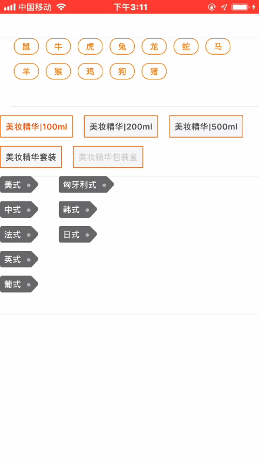

# TGTagsView

一个方便的创建标签的三方库。支持横向标签布局和纵向标签布局。

优点:

1.支持横向布局和纵向布局。

2.可以通过内部对象配置标签。

3.支持完全的自定义标签。

效果图:



如何使用:

**1. 横向布局用法:**
横向布局是固定宽度去计算高度。TGTagsViewCustomNature对象中包含了对标签容器View的一些配置属性，还有对标签本身也就是按钮的一些配置属性。

```objc

// 数据源
NSArray *contents = @[@"鼠",@"牛",@"虎",@"兔",@"龙",@"蛇",@"马",@"羊",@"猴",@"鸡",@"狗",@"猪"];

// 初始化标签容器
TGTagsView *v = [[TGTagsView alloc] init];

// 创建一个标签配置对象
TGTagsViewCustomNature *nature = [[TGTagsViewCustomNature alloc] init];
nature.fontSize = 12;
nature.textColor = [UIColor orangeColor];
nature.borderColor = [UIColor orangeColor];
nature.contentInset = UIEdgeInsetsMake(0, 20, 0, 20);
nature.itemSpace = 10;
nature.lineSpace = 12;
nature.itemHorizonInset = 12;
nature.itemCornerRaduis = 11;
...

// 创建标签
NSDictionary *tagsInfoMap = [v configDataArrayWithArray:contents customNature:nature selectHandler:^(NSInteger index, NSString *content) {
    // 点击回调
    NSLog(@"当前点击第%ld个，内容是%@",index,content);
}];
```

**2.纵向布局+自定义创建标签**

纵向布局是固定高度去计算宽度
标签的本质是一个按钮，如果TGTagsViewCustomNature对象中包含的属性并不能满足你的需求，你可以实现TGTagsViewDelegate的代理方法。通过实现

*- (CGFloat)itemWidthWithContent:(id)content index:(NSInteger)index*

*- (UIButton *)itemWithContent:(id)content index:(NSInteger)index*

两个数据源方法去创建自定义的标签。

```objc
- (void)configContents:(NSArray *)contents {
   // 数据源
   NSArray *contents = @[@"美式",@"中式",@"法式",@"英式",@"葡式",@"匈牙利式",@"韩式",@"日式"];

    // 配置对象，纵向布局需要设置isHorizonLayout为NO
    TGTagsViewCustomNature *nature = [[TGTagsViewCustomNature alloc] init];
    nature.isHorizonLayout = NO;
    ...
    
    // 初始化标签
    TGTagsView *v = [[TGTagsView alloc] init];
    NSDictionary *tagsInfoMap = [v configDataArrayWithArray:contents customNature:nature selectHandler:^(NSInteger index, NSString *content) {
         NSLog(@"当前点击第%ld个，内容是%@",index,content);
    }];
    
}

#pragma mark - TGTagsViewDelegate
- (CGFloat)itemWidthWithContent:(id)content index:(NSInteger)index {
    // 计算标签的内容宽度
}

- (UIButton *)itemWithContent:(id)content index:(NSInteger)index {
    // 创建标签
}

```

**3.单项选择标签**

如果标签需要实现单项选择功能，需要去设置TGTagsViewCustomNature对象的**isOption**属性把它设置为YES。如果你要设置默认选中可以去设置TGTagsViewCustomNature对象的**defaultSelectedArray**属性。如果你要默认禁止选中可以设置TGTagsViewCustomNature对象的**defaultEnableArray**属性。


